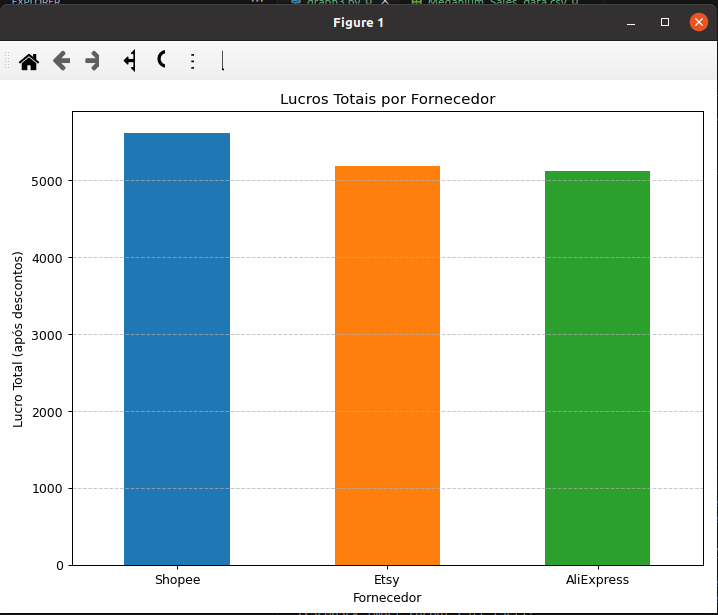

1.- Aqui está a lista organizada dos países com maior gasto total (após descontos), com base nos dados combinados dos sites AliExpress, Etsy e Shopee:

| Posição | País        | Gasto Total (após desconto) |
| ------- | ----------- | --------------------------- |
| 1       | Canadá      | 3.329,96                    |
| 2       | França      | 2.698,58                    |
| 3       | Japão       | 2.010,20                    |
| 4       | Austrália   | 1.896,75                    |
| 5       | Alemanha    | 1.710,06                    |
| 6       | Reino Unido | 1.061,33                    |
| 7       | EUA         | 472,55                      |

2.-Aqui está a lista organizada com as **datas de maior venda por fornecedor (site) e por país**, considerando o valor total gasto (após descontos):

| Fornecedor | País        | Data de Maior Venda | Gasto Total |
| ---------- | ----------- | ------------------- | ----------- |
| AliExpress | Austrália   | 2024-10-02          | 290,16      |
| AliExpress | Canadá      | 2024-10-07          | 264,52      |
| AliExpress | França      | 2024-09-08          | 368,78      |
| AliExpress | Alemanha    | 2024-05-18          | 453,49      |
| AliExpress | Reino Unido | 2024-08-16          | 292,33      |
| AliExpress | EUA         | 2024-08-07          | 293,49      |
| Etsy       | Austrália   | 2024-08-14          | 317,75      |
| Etsy       | Canadá      | 2024-06-11          | 387,12      |
| Etsy       | França      | 2024-09-10          | 408,69      |
| Etsy       | Alemanha    | 2024-07-22          | 274,06      |
| Etsy       | Japão       | 2024-08-06          | 429,52      |
| Etsy       | Reino Unido | 2024-10-27          | 210,08      |
| Etsy       | EUA         | 2024-06-03          | 103,22      |
| Shopee     | Austrália   | 2024-08-25          | 391,91      |
| Shopee     | Canadá      | 2024-09-25          | 413,03      |
| Shopee     | França      | 2024-10-30          | 308,50      |
| Shopee     | Alemanha    | 2024-05-28          | 225,96      |
| Shopee     | Japão       | 2024-10-09          | 294,83      |
| Shopee     | Reino Unido | 2024-10-02          | 206,34      |

3.- Resposta fornecida pelo script [graph3.py](../scripts/graph3.py)

